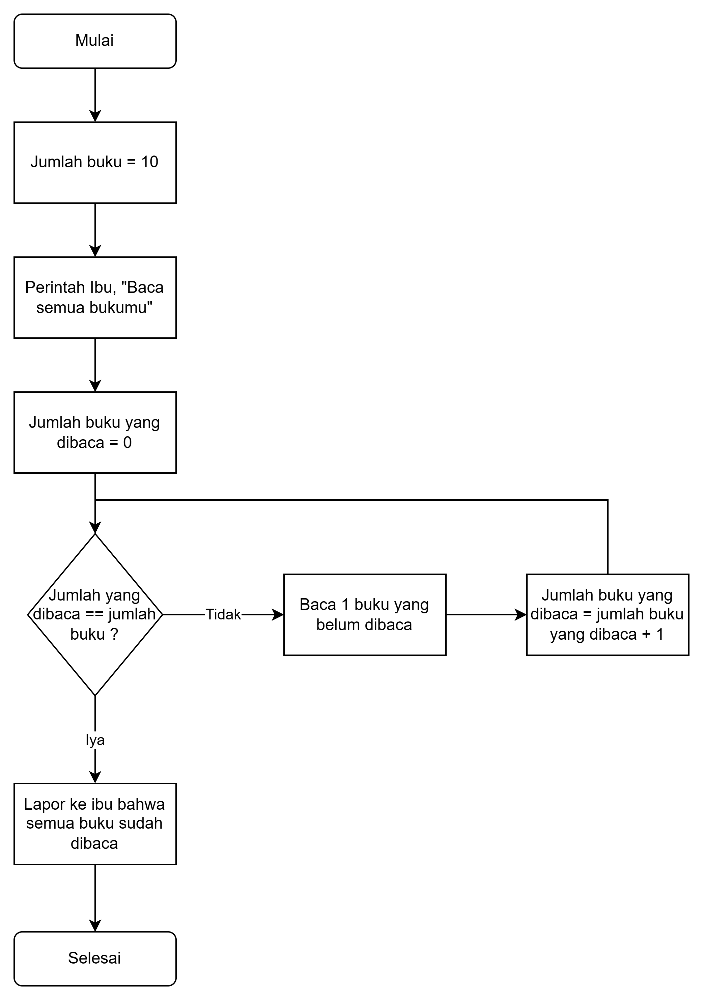

# my-first-python-code
Ini adalah project pertama saya dengan python.
Yuhuuuuu!

Saya akan tunjukkan fundamental python code

Happy Coding

Best Regard, 

Baba Riza

##################

# 1. Tugas Pertama  - Percabangan Jokes Programmer
Buatlah kode dalam python untuk flow chart berikut ini

# 2. Tugas Kedua - Perulangan dengan for dan while membaca buku dengan jumlah tertentu. contoh = 10
Buatlah kode dalam python untuk flow chart berikut ini

